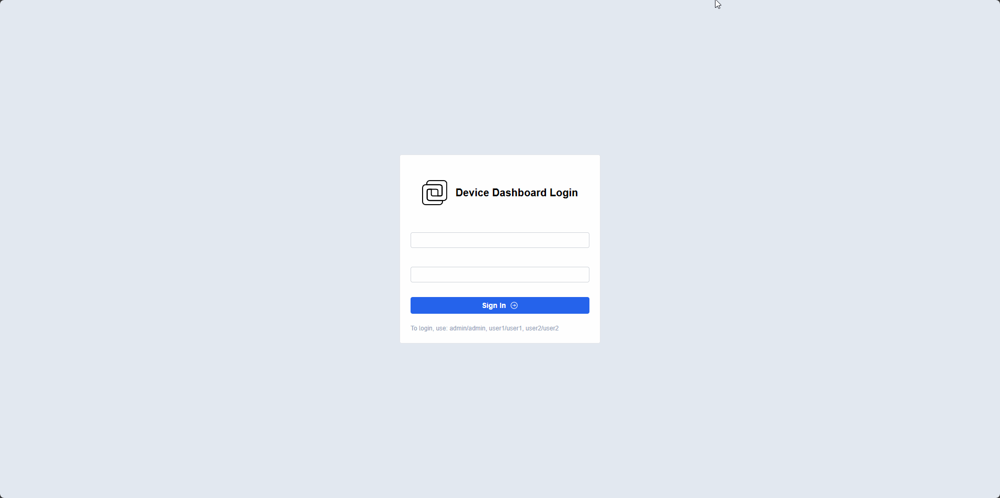

# Mongoose例程

## 简介

本例程主要功能是让ARTPI2支持Mongoose功能。
这个例程也可以做为您的创作IOT的基础工程。
## Mongoose - 嵌入式 Web 服务器 / 嵌入式网络库
### 主要特性

- **跨平台：**
  - 兼容 Linux/UNIX、MacOS、Windows、Android
  - 支持 ST、NXP、ESP32、Nordic、TI、Microchip、Infineon、Renesas 等芯片
  - 代码一次编写，可在不同平台运行
- **内置协议：** 支持 TCP/UDP、SNTP、HTTP、MQTT、WebSocket 等
- **异步 DNS 解析**
- **占用资源小：** 静态和运行时占用资源极低
- **易于集成：** 只需将 [mongoose.c](https://raw.githubusercontent.com/cesanta/mongoose/master/mongoose.c) 和 [mongoose.h](https://raw.githubusercontent.com/cesanta/mongoose/master/mongoose.h) 复制到源代码目录即可
- **内置 TCP/IP 协议栈：** 支持裸机或 RTOS 系统
  - 兼容的驱动：STM32F、STM32H、NXP RT1xxx、TI TM4C、Microchip SAME54、Wiznet W5500
  - 在 ST Nucleo 开发板上运行完整的 Web 设备控制面板仅需 6 个文件
- **可与现有的 TCP/IP 协议栈集成：** 如 lwIP、Zephyr、Azure 等
- **内置 TLS 1.3 ECC 协议栈：** 也可使用外部 TLS 库，如 mbedTLS、OpenSSL 等
- **固件更新：** 适用于 STM32 H5、STM32 H7

### 使用示例

#### 1. 简单的 HTTP 服务器

```c
#include "mongoose.h"   

// HTTP 事件处理函数
void ev_handler(struct mg_connection *c, int ev, void *ev_data) {
  if (ev == MG_EV_HTTP_MSG) {
    struct mg_http_message *hm = (struct mg_http_message *) ev_data;
    struct mg_http_serve_opts opts = { .root_dir = "./web_root/" };
    mg_http_serve_dir(c, hm, &opts);
  }
}

int main(void) {
  struct mg_mgr mgr;  // 事件管理器
  mg_mgr_init(&mgr);  // 初始化事件管理器
  mg_http_listen(&mgr, "http://0.0.0.0:8000", ev_handler, NULL);  // 监听端口
  for (;;) {
    mg_mgr_poll(&mgr, 1000);  // 事件循环
  }
  return 0;
}
```

### 2. REST API - 返回当前时间

```c
static void ev_handler(struct mg_connection *c, int ev, void *ev_data) {
  if (ev == MG_EV_HTTP_MSG) {
    struct mg_http_message *hm = (struct mg_http_message *) ev_data;
    if (mg_match(hm->uri, mg_str("/api/time/get"), NULL)) {
      mg_http_reply(c, 200, "", "{%m:%lu}\n", MG_ESC("time"), time(NULL));
    } else {
      mg_http_reply(c, 500, "", "{%m:%m}\n", MG_ESC("error"), MG_ESC("Unsupported URI"));
    }
  }
}
```

### 3. MQTT 客户端 - 订阅并回显消息

```c
#include "mongoose.h"

static const char *s_mqtt_url = "mqtt://broker.hivemq.com:1883";
static struct mg_connection *s_mqtt_conn = NULL;

// MQTT 事件处理函数
static void ev_handler(struct mg_connection *c, int ev, void *ev_data) {
  if (ev == MG_EV_OPEN) {
    MG_INFO(("%lu created, connecting to %s ...", c->id, s_mqtt_url));
  } else if (ev == MG_EV_MQTT_OPEN) {
    struct mg_mqtt_opts opts = {.qos = 1, .topic = mg_str("device1/rx")};
    mg_mqtt_sub(c, &opts);
  } else if (ev == MG_EV_MQTT_MSG) {
    struct mg_mqtt_message *mm = (struct mg_mqtt_message *) ev_data;
    struct mg_mqtt_opts opts = {.qos = 1, .topic = mg_str("device1/tx")};
    mg_mqtt_pub(c, &opts);
  } else if (ev == MG_EV_CLOSE) {
    s_mqtt_conn = NULL;
  }
}

// 重新连接定时器
static void timer_fn(void *arg) {
  struct mg_mgr *mgr = (struct mg_mgr *) arg;
  if (s_mqtt_conn == NULL) {
    struct mg_mqtt_opts opts = {.clean = true};
    s_mqtt_conn = mg_mqtt_connect(mgr, s_mqtt_url, &opts, ev_handler, NULL);
  }
}

int main() {
  struct mg_mgr mgr;
  mg_mgr_init(&mgr);
  mg_timer_add(&mgr, 3000, MG_TIMER_REPEAT | MG_TIMER_RUN_NOW, timer_fn, &mgr);
  for (;;) {
    mg_mgr_poll(&mgr, 1000);
  }
  return 0;
}
```
## 软件说明
- 使用`pkgs --upgrade` 命令更新在线软件包配置
- 该例程默认`使用SD卡加载资源文件`，需要将`wifi-host-driver`软件包中以下`firmware`和`clm`文件放到SD卡的根目录:
```
packages/wifi-host-driver-latest/wifi-host-driver/WiFi_Host_Driver/resources/clm/COMPONENT_43438/43438A1.clm_blob
packages/wifi-host-driver-latest/wifi-host-driver/WiFi_Host_Driver/resources/firmware/COMPONENT_43438/43438A1.bin
```
- 如果想不插SD卡快速实验，可取消选中`Using resources in external storage`不使用外部储存加载资源文件:
```
→ RT-Thread online packages →
    IoT - internet of things →
        Wifi-Host-Driver(WHD) for RT-Thread
            [ ]   Using resources in external storage  ---
```

## 运行
1. **准备网络环境**：确保 PC（或手机）和开发板连接到同一网段的无线路由器。
2. **下载程序**：将程序下载到开发板，并复位启动 RT-Thread。
3. **连接无线网络**：在 FinSH 控制台中输入命令 `wifi join [ssid] [password]`，连接到无线网络。
4. **启动 Web Server**：按下开发板的 user 按键，启动 Web Server。
5. **访问Web**：在 PC（或手机）的浏览器中输入URL `http://[开发板IP地址]:8000` (例如 `http://192.168.1.1:8000`)，按下回车访问web。（账号为：admin 密码：admin

### 运行效果


## 注意事项
1. 确保使用`pkgs --update`命令更新软件包，并完成了`wifi-host-driver-latest`软件包的下拉
2. 使用WiFi需要将wifi-host-driver软件包中以下firmware和clm文件放到SD卡的根目录（详细请看上文中的软件说明）
