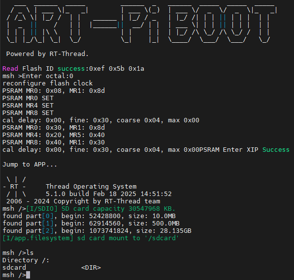

# SD卡文件系统例程

## 简介

本例程主要功能是实现了使用SD卡挂载文件系统示例。

## 硬件说明
* 准备一张 FAT 格式的 SD卡
* 将SD卡插入 ARTPI 的 SD卡槽

## 运行
### 编译&下载

编译完成后，将开发板的 ST-Link USB 口与 PC 机连接，然后将固件下载至开发板。

### 运行效果

系统启动后，会自动挂载SD卡文件系统，可以使用RTT和文件系统相关命令进行使用：

